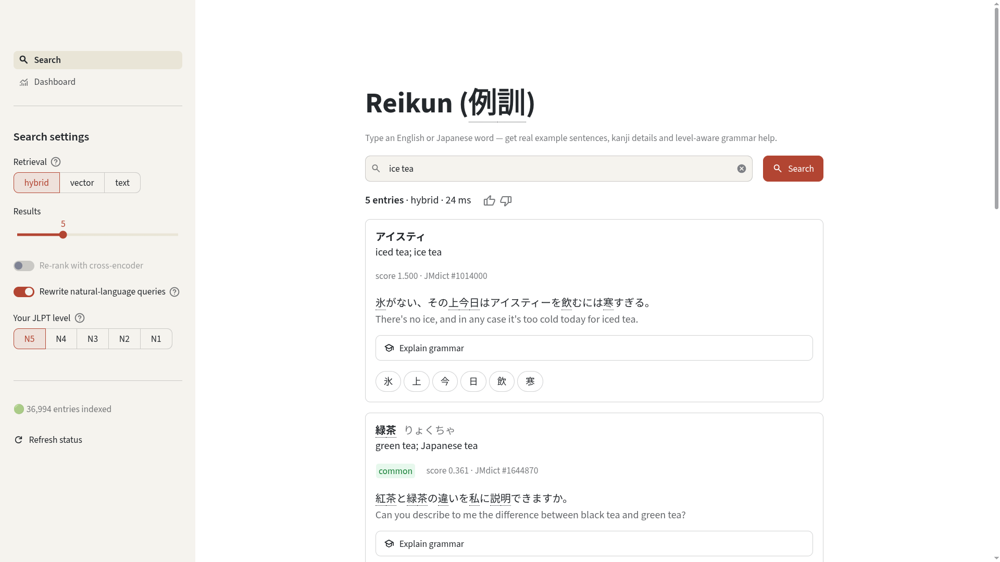

# Reikun (例訓) — Japanese Assistant

An end-to-end RAG application that helps Japanese learners find natural example sentences from an English or Japanese word query, look up any kanji in those sentences in detail, and get a JLPT-level-calibrated grammar explanation on demand.

## Demo


Full recording: [docs/videos/demo.mp4](docs/videos/demo.mp4)

**Live demo:** https://reikun.onrender.com/ — the app runs on Render, with the vector database on Qdrant Cloud and ingestion orchestrated via Prefect Cloud. All on free tiers with limited shared resources (512 MB RAM, shared CPU), so expect a slow first load (~30–60 s cold start after inactivity) and a few seconds per search. For the best experience, run it locally with Docker Compose.

## Screenshots



More captures — kanji hover tooltip, kanji detail dialog with stroke order, JLPT grammar explanation, and the monitoring dashboard — are in [`docs/screenshots/`](docs/screenshots/).

## Features

- **Hybrid Search**: Dense vector embeddings (FastEmbed) + BM25 sparse vectors fused server-side in Qdrant (RRF), plus an exact-match arm for kanji/kana lookups
- **Query Rewriting**: Natural-language questions ("how do you say hospital") are normalised to dictionary glosses before retrieval — free regex heuristics by default, optional Cohere LLM rewriting for descriptive queries
- **Kanji Lookup**: Deterministic kanji information (no LLM) — stroke-order diagrams (KanjiVG), readings, meanings, and common compound words
- **Grammar Explanations**: AI-generated grammar explanations calibrated to your JLPT level (N5–N1) using Cohere, on demand only
- **Feedback & Monitoring**: Thumbs-up/down feedback and query telemetry logged to SQLite, with a built-in dashboard (query volume, top words, feedback rate, kanji lookups, JLPT-level distribution, retrieval settings, latency)
- **Streamlit Interface**: Minimal, modern multipage UI built on `st.navigation`, `st.dialog`, and `st.fragment`

## Tech Stack

- **Frontend**: Streamlit (multipage UI: Search + Dashboard; Altair charts)
- **Vector Database**: Qdrant (named dense + sparse vectors, server-side RRF hybrid)
- **Embeddings**: FastEmbed — `all-MiniLM-L6-v2` (dense, 384-dim) + `Qdrant/bm25` (sparse), ONNX-quantized for CPU
- **LLM**: Cohere `command-a-plus-05-2026` — grammar explanations, optional query rewriting and re-ranking, LLM-judged evals (all token-budgeted)
- **Ingestion orchestration**: Prefect 3 flow (`scripts/startup.py`) — ephemeral locally, Prefect Cloud when `PREFECT_API_URL` is set
- **Monitoring**: SQLite telemetry + feedback logging (`monitoring/feedback_log.py`)
- **Data Sources**: JMdict, KANJIDIC2, Tatoeba Corpus, KanjiVG
- **Containerization**: Docker & Docker Compose

## Installation

### Prerequisites

- **Docker and Docker Compose** (recommended path — runs the app + Qdrant)
- **Cohere API key** — powers grammar explanations, optional LLM query rewriting (`QUERY_REWRITE=auto`), optional Cohere re-ranking (`RERANKER=cohere`), and the LLM evaluation. Search, kanji lookup, and the dashboard work without it.
- **Git** (to clone) and ~3 GB free disk (dictionary data + embedding models)

For local development only:

- **Python 3.11+** and **[uv](https://docs.astral.sh/uv/)** (dependency manager — `pip` works too)

### Setup

1. **Clone the repository**:
   ```bash
   git clone https://github.com/AnkS4/Reikun
   cd Reikun
   ```

2. **Set up environment variables**:
   ```bash
   cp .env.example .env
   # Edit .env and add your COHERE_API_KEY
   ```

### Running the Application

#### Option 1: Docker (Recommended)

The Docker setup automatically handles data download, processing, and ingestion on first startup:

```bash
# Start all services (Qdrant + Streamlit app)
docker compose up -d

# View logs
docker compose logs -f app

# Stop services
docker compose down
```

The web interface will be available at `http://localhost:8000` (or the port specified in your `.env` file as `APP_PORT`).

The first time you run the app, it will automatically:
- Download JMdict and KANJIDIC2 data
- Process and chunk the dictionary data
- Ingest embeddings into Qdrant

Check the Streamlit interface for initialization status before querying. Data is cached in the `data/` directory for subsequent runs. 

**Note:** The first run may take several minutes to download and process the data.

#### Option 2: Local Development

For local development without Docker:

1. **Install Python dependencies**:
   ```bash
   uv venv && uv pip install -r requirements.txt
   ```

2. **Download and process data**:
   ```bash
   # Download JMdict and KANJIDIC2 data
   uv run python scripts/download_data.py
   
   # Parse and chunk dictionary data
   uv run python scripts/build_chunks.py
   ```

3. **Start Qdrant**:
   ```bash
   docker compose up -d qdrant
   ```

4. **Ingest data into Qdrant**:
   ```bash
   # Ingest the processed data (this takes a few minutes)
   QDRANT_HOST=localhost uv run python scripts/ingest.py
   ```

5. **Run the Streamlit app**:
   ```bash
   uv run streamlit run app/streamlit_app.py
   ```
   Streamlit config (port, theme) lives in `app/.streamlit/config.toml`.

## Project Structure

```
Reikun/
├── app/
│   ├── config.py            # Central env-driven configuration
│   ├── streamlit_app.py     # Multipage entrypoint (st.navigation)
│   ├── retrieval.py         # Vector / BM25 / hybrid search, re-ranking pipeline
│   ├── query_rewrite.py     # Heuristic + optional LLM query rewriting
│   ├── kanji_lookup.py      # Deterministic KANJIDIC2 + KanjiVG lookup
│   ├── grammar_explain.py   # Cohere client, JLPT-level-aware prompts
│   ├── embedder.py          # FastEmbed dense/sparse/rerank model wrappers
│   ├── ui/
│   │   ├── common.py        # Shared styling, kanji dialog, footer
│   │   ├── search.py        # Search page
│   │   └── dashboard.py     # Monitoring dashboard (7 charts)
│   ├── .streamlit/
│   │   └── config.toml      # Streamlit server port and theme config
├── docs/
│   ├── screenshots/         # UI captures (search, kanji dialog, dashboard)
│   └── videos/              # Demo recording (gif + mp4)
├── monitoring/
│   └── feedback_log.py      # SQLite: searches, feedback, kanji lookups, explanations
├── eval/
│   ├── gold_set.json        # 24-query retrieval gold set (5 categories)
│   ├── retrieval_eval.py    # vector / BM25 / hybrid / rewrite / rerank comparison
│   ├── llm_eval.py          # level-aware vs generic prompt comparison (LLM judge)
│   ├── embed_model_bench.py # dense embedding model benchmark
│   └── results/             # generated reports
├── scripts/
│   ├── download_data.py     # Download JMdict/KANJIDIC2/KanjiVG
│   ├── build_chunks.py      # Parse and chunk dictionary data
│   ├── ingest.py            # Embed (dense + sparse) and load into Qdrant
│   └── startup.py           # Prefect flow (download → build → ingest) + entrypoint
├── .env.example             # Environment variable template
├── data/
│   ├── raw/                 # Downloaded dictionary files
│   ├── processed/           # Parsed chunks and kanji table
│   ├── kanjivg/             # Stroke-order SVGs
│   └── monitoring/          # SQLite telemetry database
├── models/                  # Cached embedding models
├── Dockerfile
├── docker-compose.yml
├── pyproject.toml
└── requirements.txt         # pinned versions
```

## Environment Variables

Create a `.env` file (see `.env.example`):

- `APP_PORT`: Port for the Streamlit application (default: 8000)
- `COHERE_API_KEY`: Required for grammar explanations (get at https://dashboard.cohere.com/api-keys)
- `COHERE_MODEL`: Cohere chat model (default: `command-a-plus-05-2026`)
- `QDRANT_HOST` / `QDRANT_PORT`: Qdrant connection (defaults: localhost / 6333); `QDRANT_URL` + `QDRANT_API_KEY` override for Qdrant Cloud
- `QDRANT_COLLECTION`: Qdrant collection name (default: jmdict_chunks)
- `EMBED_MODEL`: Dense embedding model (default: `sentence-transformers/all-MiniLM-L6-v2`)
- `RERANKER`: Re-ranking backend — `none` (default), `local`, or `cohere`. Off by default: evaluation showed both options reduce MRR on this bilingual corpus
- `QUERY_REWRITE`: `heuristic` (default, free), `auto` (adds one Cohere call for long English queries — best MRR but uses trial-tier quota), or `off`

### Cohere free-tier notes

Tuned for a trial key (~10 calls/min): explanations are on-demand only with bounded token budgets and 429 retry/backoff. `QUERY_REWRITE=auto` and `RERANKER=cohere` each add one call per search — keep them off on the free tier.

## Port Configuration

| Service     | Container | Host (Docker)                | Host (Local) |
|-------------|-----------|------------------------------|--------------|
| Streamlit   | 8501      | `APP_PORT` (default: 8000)   | 8501         |
| Qdrant      | 6333      | 6333                         | 6333         |
| Qdrant gRPC | 6334      | 6334                         | 6334         |

Docker maps `${APP_PORT:-8000}:8501` — change `APP_PORT` in `.env`, then `docker compose up -d`. For local runs, the Streamlit port is set in `app/.streamlit/config.toml`; you can override it with `--server.port` if needed.

## Evaluation

Reproducible evaluation scripts live in `eval/`; reports are written to `eval/results/`.

| Script | What it measures | Required setup | Outputs | API calls | Typical runtime |
|---|---|---|---|---|---|
| `eval/retrieval_eval.py` | Hit@k, MRR, NDCG@5, and MAP for vector/BM25/hybrid + query rewrite + rerank | Qdrant running with `jmdict_chunks` indexed | `eval/results/retrieval_eval.{json,md}` | None with `--no-llm`; Cohere otherwise | `--no-llm`: ~30s; full grid: ~10–15min |
| `eval/embed_model_bench.py` | Dense embedding model throughput and retrieval accuracy (MiniLM vs arctic-xs, vector-only, in-memory) | `data/processed/chunks.json` and `eval/gold_set.json` | `eval/results/embed_model_bench.json` | None | ~20min (first run may download models) |
| `eval/llm_eval.py` | Level-aware vs generic grammar explanations, scored by a Cohere judge | `COHERE_API_KEY`, free-tier quota, and `data/processed/chunks.json` | `eval/results/llm_eval.{json,md}` | ~8 calls per sentence (2 levels × 2 prompts × 2 calls) | ~4–5min for 5 sentences (Cohere 10 calls/min limit) |

Runtimes are approximate on a modest CPU with local Qdrant; embedding-model and Cohere cold starts can add time on the first run.

Run the retrieval benchmark without any paid API calls:

```bash
# vector vs BM25 vs hybrid vs +heuristic rewrite vs +local rerank (no Cohere)
uv run python eval/retrieval_eval.py --no-llm
```

Run the full grid, including `auto` LLM rewriting and Cohere rerank (uses Cohere quota):

```bash
uv run python eval/retrieval_eval.py
```

Embedding model benchmark (defaults to the two models in `eval/embed_model_bench.py`; add others with `--models`):

```bash
uv run python eval/embed_model_bench.py
```

LLM prompt evaluation (default 5 sentences; tune with `--sentences N`):

```bash
uv run python eval/llm_eval.py
```

Headline results (`eval/results/retrieval_eval.md`, 24-query gold set): hybrid + heuristic query rewriting wins — Hit@1 0.67, Hit@5 0.83, MRR 0.724 vs 0.365 MRR for vector-only. Re-ranking (local cross-encoder or Cohere) reduced MRR on this bilingual corpus, so it ships disabled.

## Data Sources

- **JMdict**: Japanese-English dictionary data © Jim Breen & EDRDG (CC BY-SA 4.0)
- **KANJIDIC2**: Kanji dictionary data © Jim Breen & EDRDG (CC BY-SA 4.0)
- **Tatoeba Corpus**: Example sentences (CC-BY 2.0 FR)
- **KanjiVG**: Kanji stroke order diagrams (CC BY-SA 3.0)
