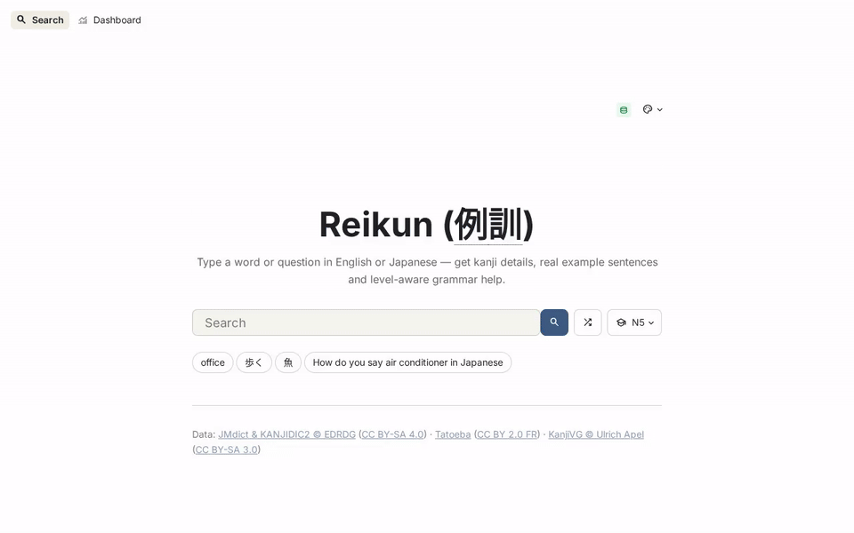

<p align="center">
  
</p>
<h1 align="center">Reikun (例訓) — Semantic Japanese Dictionary</h1>

A semantic Japanese dictionary that helps learners find natural example sentences from an English or Japanese word query, look up any kanji in those sentences in detail, and get a JLPT-level-calibrated grammar explanation on demand.

## Demo



Full recording: [docs/videos/demo_v2.mp4](docs/videos/demo_v2.mp4)

> **Try it live:** https://reikun.app/

## Features

- **Hybrid Search with query routing**: Dense vector embeddings (FastEmbed) + BM25 sparse vectors fused server-side in Qdrant (RRF). `mode=auto` routes the query: Japanese → BM25 + exact match, English word → hybrid + commonness prior, English sentence → dense-weighted fusion. Explicit `vector`/`text`/`hybrid` modes remain for evaluation
- **Query Rewriting**: Natural-language questions ("how do you say hospital") are normalised to dictionary glosses before retrieval — free regex heuristics by default, optional Cohere LLM rewriting for descriptive queries
- **Kanji Lookup**: Deterministic kanji information (no LLM) — stroke-order diagrams (KanjiVG), readings, meanings, and common compound words
- **Grammar Explanations**: AI-generated grammar explanations calibrated to your JLPT level (N5–N1) using Cohere, on demand only
- **Feedback & Monitoring**: Thumbs-up/down feedback and query telemetry logged to SQLite, with a built-in dashboard (query volume, top words, feedback rate, kanji lookups, JLPT-level distribution, retrieval settings, latency)
- **Streamlit Interface**: Search-first landing page, furigana (`<ruby>`) headwords, animated stroke order, light/dark themes, shareable URLs (`?q=猫&level=N3`), one-click level-aware grammar explanations; built on `st.navigation`, `st.dialog`, `st.fragment` and URL-bound widgets
- **HTTP API**: FastAPI layer (`app/api.py`) over the same pipeline — mounted at `/api` inside the app process in Docker, or standalone via uvicorn; includes SSE streaming for explanations

## Tech Stack

- **Frontend**: Streamlit (multipage UI: Search + Dashboard; Altair charts; Inter + Noto Sans JP web fonts)
- **API**: FastAPI + Uvicorn (thin wrapper, optional)
- **Vector Database**: Qdrant (named dense + sparse vectors, server-side RRF hybrid)
- **Embeddings**: FastEmbed — `all-MiniLM-L6-v2` (dense, 384-dim) + `Qdrant/bm25` (sparse), ONNX-quantized for CPU
- **LLM**: Cohere `command-a-plus-05-2026` — grammar explanations, optional query rewriting and re-ranking, LLM-judged evals (all token-budgeted)
- **Ingestion pipeline**: `scripts/startup.py` can run wait-for-Qdrant → check-state → download → build → ingest with retries, then launch the app — opt-in via `INGEST=1` or `--ingest` (off by default; `--ingest-only` runs it without the UI)
- **Monitoring**: SQLite telemetry + feedback logging (`monitoring/feedback_log.py`)
- **Data Sources**: JMdict, KANJIDIC2, Tatoeba Corpus, KanjiVG
- **Containerization**: Docker & Docker Compose

## Installation

### Prerequisites

- **Docker and Docker Compose** (recommended path — runs the app + Qdrant)
- **Cohere API key** — powers grammar explanations, optional LLM query rewriting (`QUERY_REWRITE=auto`), and the LLM evaluation. Search, kanji lookup, and the dashboard work without it.
- **Git** (to clone) and ~3 GB free disk (dictionary data + embedding models)

For local development only:

- **Python 3.13+** and **[uv](https://docs.astral.sh/uv/)** (dependency manager — `pip` works too)

### Setup

1. **Clone the repository**:
   ```bash
   git clone https://github.com/AnkS4/Reikun
   cd Reikun
   ```

2. **Set up environment variables**:
   ```bash
   cp .env.example .env
   # Edit .env and add your COHERE_API_KEY
   ```

### Running the Application

#### Option 1: Docker (Recommended)

First run — let the container self-provision (rsync + dev deps into the image, then download → build → ingest ~219k entries at boot; embedding takes ~1 hr):

```bash
INGEST_VIA_DOCKER=1 docker compose up -d --build
```

(or set `INGEST_VIA_DOCKER=1` in `.env` for the same effect on every `docker compose up --build`)

**Or**, if Qdrant is already populated — plain `up` serves whatever it already holds:

```bash
docker compose up -d

# View logs
docker compose logs -f app

# Stop services
docker compose down
```

The web interface will be available at `http://localhost:8000` (or the port specified in your `.env` file as `APP_PORT`).

Alternatively, run the pipeline on the host instead of in the container (dev deps install via `uv sync`; ingestion is off by default without `INGEST_VIA_DOCKER`):

```bash
uv run python scripts/download_edrdg.py    # JMdict NG + KANJIDIC2 XML
uv run python scripts/download_kanjivg.py  # KanjiVG stroke-order SVGs
uv run python scripts/build_chunks.py      # writes data/processed/
uv run python scripts/ingest.py            # embed + load all ~219k entries
```

**Note:** a full ingest embeds ~219k entries (~1 hr); `--common` loads only the ~37k common-entries subset for a quick test. Data is cached in the `data/` directory for subsequent runs.

The embedding models are pre-downloaded into the image and live in a named volume (`models`), so `docker compose down -v` discards them and the next start re-copies them from the image. If external hostnames (HF Hub, ftp.edrdg.org, Cohere) fail to resolve from inside the container, copy `docker-compose.override.yml.example` to `docker-compose.override.yml` to pin public DNS resolvers.

#### Option 2: Local Development

For local development without Docker:

1. **Install Python dependencies** (creates `.venv` and installs locked deps):
   ```bash
   uv sync
   ```

2. **Download and process data**:
   ```bash
   # Sync JMdict NG + KANJIDIC2 XML from EDRDG (needs rsync), and KanjiVG SVGs
   uv run python scripts/download_edrdg.py
   uv run python scripts/download_kanjivg.py
   
   # Parse and chunk dictionary data
   uv run python scripts/build_chunks.py
   ```

3. **Start Qdrant**:
   ```bash
   docker compose up -d qdrant
   ```

4. **Ingest data into Qdrant**:
   ```bash
   # Ingest the processed data (this takes a few minutes)
   QDRANT_HOST=localhost uv run python scripts/ingest.py
   ```

5. **Run the Streamlit app**:
   ```bash
   uv run streamlit run app/streamlit_app.py
   ```
   Streamlit config (port, fonts, light/dark themes) lives in `app/.streamlit/config.toml`. Switch theme from the ⋮ menu → Settings.

6. **(Optional) Run the HTTP API**:

   The API is a thin FastAPI layer over the same modules the UI uses — `app/api.py`. Two ways to serve it:
   ```bash
   # Standalone (separate process) — Swagger UI at http://localhost:8100/docs
   uv run uvicorn app.api:app --port 8100 --reload

   # In-process, beside the UI on one port — API at http://localhost:8501/api
   uv run streamlit run app/asgi_app.py
   ```
   Docker runs the combined app automatically (`scripts/startup.py` launches `app/asgi_app.py`), so the API is at `http://localhost:8000/api` with docs at `/api/docs`. Endpoints: `GET /health`, `GET /search?q=…&n=10&mode=auto`, `GET /kanji/{char}?svg=true`, `POST /explain`, `POST /explain/stream` (SSE), `POST /feedback`.

7. **(Optional) Lint**:
   ```bash
   uvx ruff check app scripts eval     # config in pyproject.toml [tool.ruff]
   uvx ruff check --fix app scripts eval
   ```
   Rules target Python 3.13. RUF001–003 (“ambiguous” Unicode) are disabled on purpose — full-width and CJK characters are the subject matter here, not typos.

### URL parameters

The Search page keeps its state in the URL, so results are shareable and the browser back button works:

| Param | Example | Meaning |
|---|---|---|
| `q` | `?q=食べる` | Runs the search on load |
| `level` | `?level=N3` | JLPT level used for grammar explanations (remembered until changed) |
| `kanji` | `?kanji=猫` | Opens the kanji detail dialog once |

## Project Structure

```
Reikun/
├── app/
│   ├── config.py            # Central env-driven configuration
│   ├── api.py               # FastAPI layer (/search, /kanji, /explain, /feedback, /health)
│   ├── asgi_app.py          # Combined app: Streamlit UI + FastAPI mounted at /api
│   ├── streamlit_app.py     # Multipage entrypoint (st.navigation, top nav)
│   ├── retrieval.py         # Vector / BM25 / hybrid search, re-ranking pipeline
│   ├── query_rewrite.py     # Heuristic + optional LLM query rewriting
│   ├── kanji_lookup.py      # Deterministic KANJIDIC2 + KanjiVG lookup
│   ├── grammar_explain.py   # Cohere client, JLPT-level-aware prompts
│   ├── embedder.py          # FastEmbed dense/sparse model wrappers
│   ├── ui/
│   │   ├── common.py        # Shared styling, furigana, animated stroke SVG, kanji dialog, footer
│   │   ├── search.py        # Search page (URL-bound query/level, Advanced popover)
│   │   └── dashboard.py     # Monitoring dashboard (7 charts)
│   ├── .streamlit/
│   │   └── config.toml      # Streamlit server port, web fonts, light/dark themes
├── docs/
│   ├── screenshots/         # UI captures (search, kanji dialog, dashboard)
│   └── videos/              # Demo recording (gif + mp4)
├── monitoring/
│   └── feedback_log.py      # SQLite: searches, feedback, kanji lookups, explanations
├── eval/
│   ├── gold_set.tsv         # gold set — en_words/en_verbs (default), en_descriptive, ja_*
│   ├── eval.py              # unified eval: headword bench + knob sweep (default), --modes, --ir, --llm
│   ├── embed_model_bench.py # dense embedding model benchmark
│   └── results/             # generated reports
├── scripts/
│   ├── download_edrdg.py    # Sync JMdict NG + KANJIDIC2 XML from EDRDG (rsync)
│   ├── download_kanjivg.py  # Download KanjiVG stroke-order SVGs
│   ├── build_chunks.py      # Parse and chunk dictionary data
│   ├── ingest.py            # Embed (dense + sparse) and load into Qdrant
│   └── startup.py           # Ingestion pipeline (wait → download → build → ingest) + entrypoint
├── .env.example             # Environment variable template
├── data/
│   ├── raw/                 # Downloaded dictionary files
│   ├── processed/           # Parsed chunks and kanji table
│   ├── kanjivg/             # Stroke-order SVGs
│   └── monitoring/          # SQLite telemetry database
├── models/                  # Cached embedding models (local runs; Docker uses a named volume)
├── Dockerfile
├── docker-compose.yml
├── docker-compose.override.yml.example  # optional host-specific overrides (e.g. DNS)
├── pyproject.toml           # pinned deps + dev group (ingest-only deps)
└── uv.lock                  # locked resolution (uv sync --frozen)
```

## Environment Variables

Create a `.env` file (see `.env.example`):

- `APP_PORT`: Port for the Streamlit application (default: 8000)
- `COHERE_API_KEY`: Required for grammar explanations (get at https://dashboard.cohere.com/api-keys)
- `COHERE_MODEL`: Cohere chat model (default: `command-a-plus-05-2026`)
- `QDRANT_HOST` / `QDRANT_PORT`: Qdrant connection (defaults: localhost / 6333); `QDRANT_URL` + `QDRANT_API_KEY` override for Qdrant Cloud
- `QDRANT_COLLECTION`: Qdrant collection name (default: jmdict_chunks)
- `EMBED_MODEL`: Dense embedding model (default: `sentence-transformers/all-MiniLM-L6-v2`)
- `QUERY_REWRITE`: `heuristic` (default, free), `auto` (adds one Cohere call for long English queries — best MRR but uses trial-tier quota), or `off`

### Cohere free-tier notes

Tuned for a trial key (~10 calls/min): explanations are on-demand only with bounded token budgets and 429 retry/backoff. `QUERY_REWRITE=auto` adds one call per search — keep it off on the free tier.

## Port Configuration

| Service     | Container | Host (Docker)                | Host (Local) |
|-------------|-----------|------------------------------|--------------|
| Streamlit   | 8501      | `APP_PORT` (default: 8000)   | 8501         |
| HTTP API    | —         | under `APP_PORT` at `/api`   | `/api` on 8501, or standalone 8100 |
| Qdrant      | 6333      | 6333                         | 6333         |
| Qdrant gRPC | 6334      | 6334                         | 6334         |

Docker maps `127.0.0.1:${APP_PORT:-8000}:8501` — change `APP_PORT` in `.env`, then `docker compose up -d`. All host ports are bound to loopback only (Qdrant has no auth by default), so nothing is reachable from the LAN; the app reaches Qdrant over the internal compose network. For local runs, the Streamlit port is set in `app/.streamlit/config.toml`; you can override it with `--server.port` if needed.

## Evaluation

Reproducible evaluation scripts live in `eval/`; reports are written to `eval/results/`.

| Script | What it measures | Required setup | Outputs | API calls | Typical runtime |
|---|---|---|---|---|---|
| `eval/eval.py` | Headword Hit@1/2/5 vs gold (default); `--canon/--pool/--common` sweep; `--modes` text/hybrid/auto; `--ir` Hit@k/MRR/NDCG/MAP grid; `--llm` judge eval | Qdrant running with `jmdict_chunks` indexed (`COHERE_API_KEY` for `--llm` and LLM `--ir` configs) | `eval_headword_*`, `eval_grid_*.csv`, `eval_modes_*`, `retrieval_eval.*`, `llm_eval.*` in `eval/results/` | None for headword/modes/`--ir --no-llm`; Cohere otherwise | headword ~30s; `--ir` full grid ~10–15min; `--llm` ~4–5min (10 calls/min cap) |
| `eval/embed_model_bench.py` | Dense embedding model throughput and retrieval accuracy (vector-only, in-memory) | `data/processed/chunks.json` and `eval/gold_set.tsv` | `eval/results/embed_model_bench.json` | None | ~20min (first run may download models) |

Runtimes are approximate on a modest CPU with local Qdrant; embedding-model and Cohere cold starts can add time on the first run.

**Gold subsets.** `eval/gold_set.tsv` holds 300 queries in 6 categories; `--subsets` selects them — default is `en_words` + `en_verbs` (the 100-query English-word benchmark):

```bash
# default: English words + verbs
uv run python eval/eval.py

# Japanese exact-lookup route (kanji / hiragana / katakana)
uv run python eval/eval.py --subsets ja_words ja_hiragana ja_katakana

# long descriptive queries (exercises the Cohere rewrite path)
uv run python eval/eval.py --subsets en_descriptive
```

Expected on the Japanese subsets (ja_words + ja_hiragana + ja_katakana, 150 queries): **Hit@1 ≈ 98%, Hit@2 = 100%** — the residual misses are rare BM25 near-matches (いいえ over 家, デュース over ジュース, 虚 over 空), not missing data.

Run the retrieval benchmark without any paid API calls:

```bash
# vector vs BM25 vs hybrid vs +heuristic rewrite (no Cohere)
uv run python eval/eval.py --ir --no-llm
```

Run the full grid, including `auto` LLM rewriting (uses Cohere quota):

```bash
uv run python eval/eval.py --ir
```

Embedding model benchmark (defaults to the two models in `eval/embed_model_bench.py`; add others with `--models`):

```bash
uv run python eval/embed_model_bench.py
```

LLM prompt evaluation (default 5 sentences; tune with `--sentences N`):

```bash
uv run python eval/eval.py --llm
```

Headline results (`eval/results/retrieval_eval.md`, 300-query gold set): auto + heuristic query rewriting wins — Hit@1 0.80, Hit@5 0.87, MRR 0.828. A re-ranking stage (local cross-encoder or Cohere) was evaluated, reduced MRR on this bilingual corpus, and was removed.

## Data Sources

- **JMdict**: Japanese-English dictionary data © Jim Breen & EDRDG (CC BY-SA 4.0)
- **KANJIDIC2**: Kanji dictionary data © Jim Breen & EDRDG (CC BY-SA 4.0)
- **Tatoeba Corpus**: Example sentences (CC-BY 2.0 FR)
- **KanjiVG**: Kanji stroke order diagrams (CC BY-SA 3.0)

## License

Code is licensed under [Apache-2.0](LICENSE). Dictionary data remains under its
source licenses (see [NOTICE](NOTICE)) — derived files under `data/` are
share-alike per CC BY-SA.
